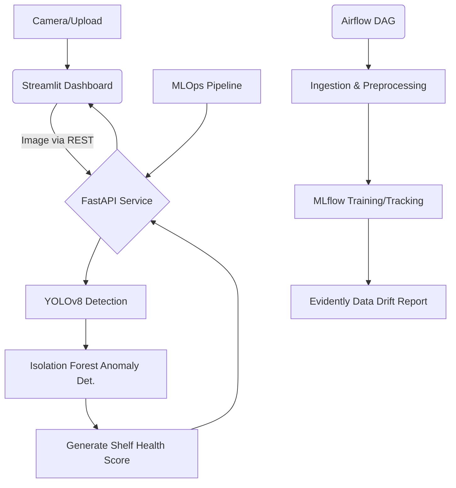

# Smart Retail Shelf Intelligence System 🛒📸 

An end-to-end Machine Learning, Computer Vision, and MLOps system that analyzes retail shelf images to accurately detect empty shelf slots, identify misplaced products, and calculate overall "shelf health" scores for compliance and restocking efficiency.

## 🏗️ Architecture Overview

The system processes incoming imagery via a dual-model pipeline: Object Detection isolates products and empty slots, while an Anomaly Detection model identifies patterns to flag misplaced items. 



- **Computer Vision Model**: Ultralytics YOLOv8 (Detects empty slots & generic products)
- **Anomaly Detection**: Scikit-Learn Isolation Forest (Detects misplaced items from localized visual features)
- **API Engine**: FastAPI 
- **Experiment Tracking**: MLflow
- **Orchestration**: Apache Airflow
- **Monitoring**: Evidently AI (Data Drift Detection)
- **Frontend Dashboard**: Streamlit

---

## 🚀 Getting Started

### 1. Installation 
Clone the repository and set up a Python 3.10 virtual environment.

```bash
git clone https://github.com/hsivasub/Smart-Retail-Shelf-Intelligence-System.git
cd Smart-Retail-Shelf-Intelligence-System
python -m venv venv
source venv/bin/activate  # On Windows: venv\Scripts\activate
pip install -r requirements.txt
```

### 2. Running the MLOps Pipeline (Airflow)
To schedule ingestion, training, and tracking:
```bash
airflow standalone
# Set your AIRFLOW_HOME to the project root, or copy dags/ to ~/airflow/dags
# Trigger the 'smart_shelf_training_pipeline' in the UI (http://localhost:8080)
```

### 3. Running the Inference Backend (FastAPI)
The backend service accepts images and serves inference results dynamically.
```bash
python src/api/main.py
# Or use uvicorn: uvicorn src.api.main:app --host 0.0.0.0 --port 8000 --reload
```
The API will be available at [http://localhost:8000/docs](http://localhost:8000/docs) (Swagger UI).

### 4. Running the Dashboard (Streamlit)
To visualize the intelligence, run the frontend CLI:
```bash
streamlit run dashboard/app.py
```
Access the dashboard at [http://localhost:8501](http://localhost:8501).

---

## 📖 API Documentation

### `POST /analyze-shelf`
Analyzes a shelf image and returns detections, health scores, and operational metrics.

**Request Form Data:**
- `file`: Uploadable image file (jpg, jpeg, png)

**Response Model Form:**
```json
{
  "shelf_health_score": 92.5,
  "total_products_detected": 50,
  "empty_slots_detected": 5,
  "misplaced_items_detected": 2,
  "detections": [
    {
      "x_center": 0.5,
      "y_center": 0.5,
      "width": 0.1,
      "height": 0.2,
      "class_name": "product",
      "confidence": 0.98
    }
  ]
}
```

---

